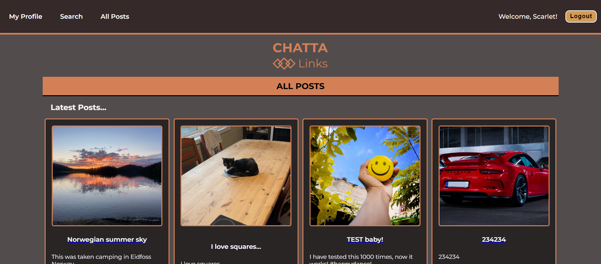

# FED2-JS2-CA - CHATTA LINKS

A Front-End social media web application built as part of the JavaScript 2 course Assignment. This project demonstrates modern JavaScript skills, ES6 modules, and API integration by allowing users to create and interact with posts in real time.

## FEATURES

- **User Registration & Login** – Secure authentication using the [Noroff API](https://docs.noroff.dev/docs/v2)
- **CRUD Operations** – Create, read, update, and delete your own posts
- **User Profiles** – View your profile and other users' posts
- **Follow/Unfollow** – Connect with other users
- **Search** – Find posts through a search bar

## TECH STACK

- **JavaScript (ES6 Modules)**
- **HTML5 & CSS**
- **Noroff Social Media API**
- **Deployment** – Netlify

## GETTING STARTED

### Clone the repo:

git clone https://github.com/camiP89/FED2-JS2-CA.git

### Install dependencies:

npm install

### Run locally:

npm run dev

## LINKS

- **Live Site:** [https://chatta-links-js2-ca.netlify.app/](https://chatta-links-js2-ca.netlify.app/)

- **GitHub Repository:** [https://github.com/camiP89/FED2-JS2-CA](https://github.com/camiP89/FED2-JS2-CA)

## Register a New User (Restrictions)

The name value must not contain punctuation symbols apart from underscore (_).
The email value must be a valid stud.noroff.no email address.
The password value must be at least 8 characters.
If set, the bio value must be less than 160 characters.
If set, the avatar.url value must be a valid and accessible URL.
If set, the avatar.alt value must be less than 120 characters. Defaults to empty string (""). Requires avatar.url to be set.
